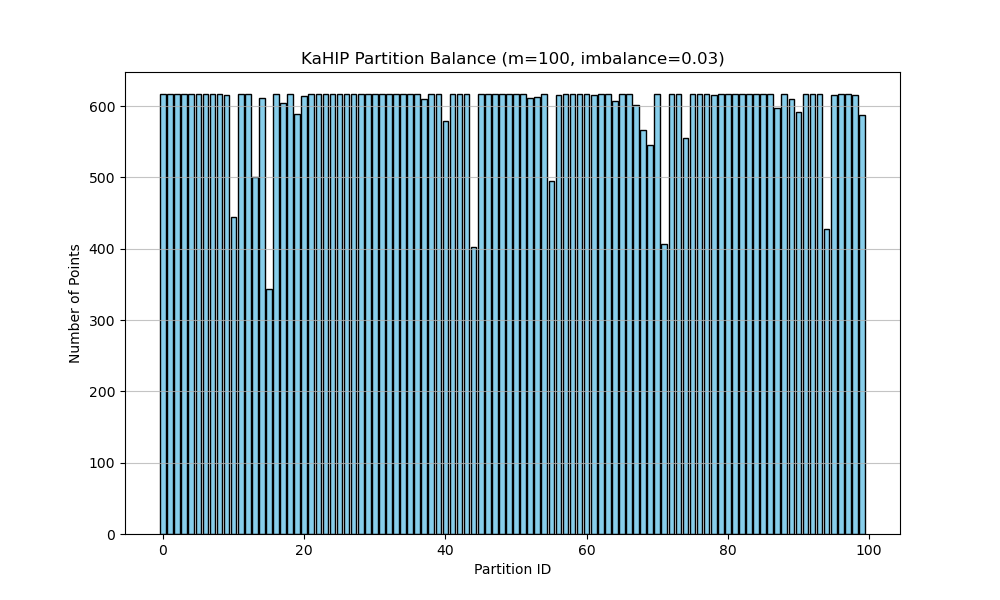
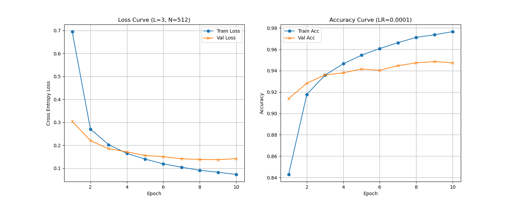
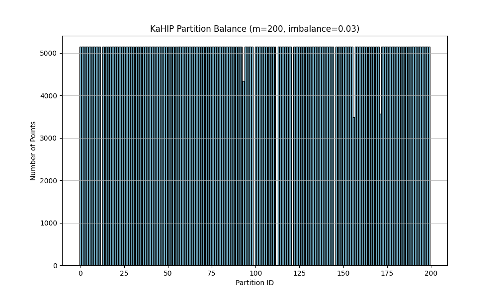
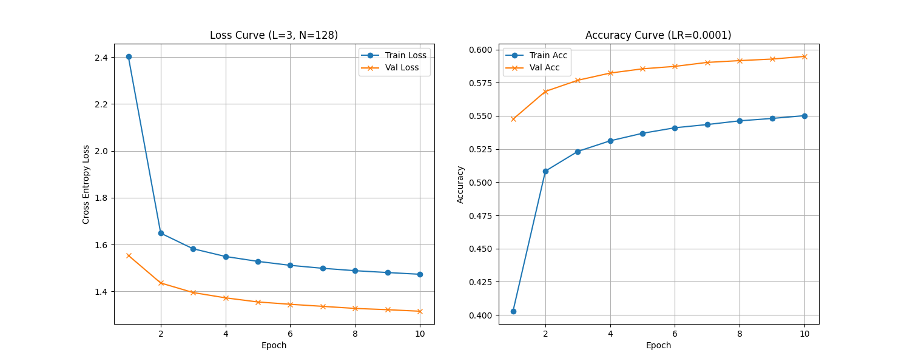
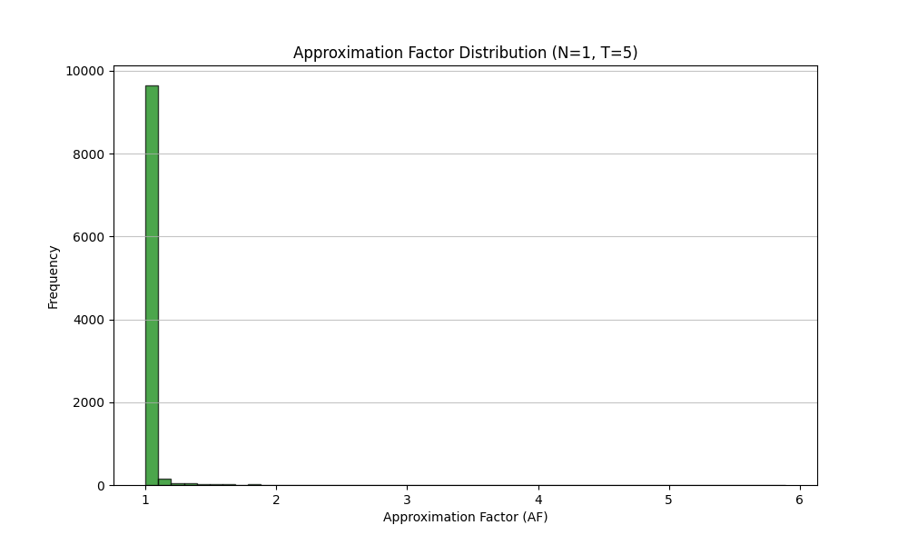

# Experimental Report: Neural LSH & Comparative Analysis

## 1. Ανάλυση Υλοποίησης Neural LSH

Η υλοποίηση του αλγορίθμου Neural LSH βασίστηκε στη θεωρία που παρουσιάστηκε στις διαλέξεις και χωρίζεται σε τέσσερα διακριτά στάδια. Παρακάτω γίνεται η αντιστοίχιση της θεωρίας με τον κώδικα που αναπτύχθηκε.

### Βήμα 1: Κατασκευή Γράφου k-NN (Graph Construction)
**Θεωρία:** Ο αλγόριθμος ξεκινά με την κατασκευή ενός γράφου $G=(P, E)$ όπου οι κορυφές είναι τα σημεία του συνόλου δεδομένων και οι ακμές συνδέουν τους $k$ πλησιέστερους γείτονες. Ο γράφος μετατρέπεται σε συμμετρικό.
**Υλοποίηση (`nlsh_build.py`, `graph_utils.py`):**
Χρησιμοποιούμε είτε την `sklearn.neighbors.NearestNeighbors` είτε το C++ executable (`-algo brute` ή `-algo ivfflat`) για τον υπολογισμό των γειτόνων.
*   Ο κώδικας διαβάζει τα δεδομένα (`data_parser.py`).
*   Δημιουργεί τον πίνακα γειτνίασης και τον αποθηκεύει ως `*_knn_graph.npy`.
*   Για τη βιβλιοθήκη KaHIP, ο γράφος μετατρέπεται σε μορφή CSR (Compressed Sparse Row) μέσω της συνάρτησης `export_to_kahip_format` στο `graph_utils.py`.

### Βήμα 2: Διαμέριση Γράφου (Graph Partitioning)
**Θεωρία:** Στόχος είναι η διαμέριση του γράφου σε $m$ μέρη (buckets) ώστε να ελαχιστοποιηθούν οι ακμές που κόβονται (cut edges) διατηρώντας τα μέρη ισομεγέθη (balanced). Αυτό εξασφαλίζει ότι γειτονικά σημεία καταλήγουν στο ίδιο bucket.
**Υλοποίηση (`nlsh_build.py`):**
Χρησιμοποιείται η βιβλιοθήκη **KaHIP** (Karlsruhe High Quality Partitioning).
*   Η εντολή `kahip.kaffpa` καλείται με παραμέτρους όπως `imbalance` (π.χ. 0.03) και `blocks` ($m$).
*   Το αποτέλεσμα είναι ένα διάνυσμα ετικετών (labels) όπου για κάθε σημείο $p$ αντιστοιχεί ένα bucket ID $\pi(p) \in \{0, \dots, m-1\}$.

### Βήμα 3: Εκπαίδευση Ταξινομητή (Supervised Learning)
**Θεωρία:** Εκπαίδευση ενός Νευρωνικού Δικτύου (MLP) $M(p)$ που μαθαίνει να προβλέπει το bucket ID $\pi(p)$ δοθέντος του διανύσματος $p$.
**Υλοποίηση (`models.py`, `nlsh_build.py`):**
*   **Αρχιτεκτονική:** Ένα MLP με ReLU activations και Softmax στην έξοδο.
    *   Input: $d$ (διάσταση δεδομένων, π.χ. 784 για MNIST).
    *   Hidden Layers: Παραμετροποιήσιμα (π.χ. 3 layers των 512 κόμβων).
    *   Output: $m$ (αριθμός buckets).
*   **Loss Function:** Cross Entropy Loss (καθώς πρόκειται για πρόβλημα classification).
*   **Optimizer:** Adam με learning rate (π.χ. 0.001).

### Βήμα 4: Αναζήτηση (Querying)
**Θεωρία:** Για ένα query $q$, το δίκτυο προβλέπει πιθανότητες για κάθε bucket. Επιλέγουμε τα $T$ buckets με την υψηλότερη πιθανότητα (Multi-probe) και ψάχνουμε εξαντλητικά μόνο στα σημεία αυτών των buckets.
**Υλοποίηση (`nlsh_search.py`):**
*   Φόρτωση του μοντέλου (`model.pth`) και του ευρετηρίου (`index_bins.npy`).
*   Forward pass του query στο δίκτυο -> `probs`.
*   Επιλογή `top_k` buckets (όπου $k=T$).
*   Συλλογή υποψηφίων (candidates) και υπολογισμός Ευκλείδειας απόστασης.
*   Επιστροφή των $N$ πλησιέστερων γειτόνων.

---

## 2. Ανάλυση Εκπαίδευσης Neural LSH (Graphs)
### MNIST
#### Partition Balance

**Ανάλυση:**
Το ιστόγραμμα δείχνει τον αριθμό των σημείων που ανατέθηκαν σε κάθε ένα από τα 100 buckets ($m=100$) για το MNIST dataset.
*   Παρατηρούμε ότι η κατανομή είναι **εξαιρετικά ομοιόμορφη** (σχεδόν "flat").
*   Αυτό επιβεβαιώνει ότι το KaHIP λειτούργησε σωστά, τηρώντας τον περιορισμό του `imbalance=0.03`.
*   Η ισορροπία είναι κρίσιμη για την απόδοση της αναζήτησης, καθώς αποτρέπει την ύπαρξη "γιγαντιαίων" buckets που θα καθυστερούσαν τον υπολογισμό αποστάσεων.

#### Learning Curve

**Ανάλυση:**
*   **Loss (Αριστερά):** Η συνάρτηση κόστους (Cross Entropy) μειώνεται ομαλά και σταθερά τόσο για το Training όσο και για το Validation set. Δεν παρατηρείται έντονο overfitting (οι καμπύλες είναι κοντά).
*   **Accuracy (Δεξιά):** Η ακρίβεια αυξάνεται γρήγορα και σταθεροποιείται σε υψηλά επίπεδα (>95% Validation Accuracy).
*   **Συμπέρασμα:** Το δίκτυο έμαθε επιτυχώς τη γεωμετρική δομή που επέβαλε η διαμέριση του KaHIP. Η υψηλή ακρίβεια σημαίνει ότι το δίκτυο μπορεί να κατευθύνει τα queries στα σωστά buckets με μεγάλη αξιοπιστία.

### SIFT
#### Partition Balance


**Ανάλυση:**
Το ιστόγραμμα δείχνει την κατανομή των σημείων στα 200 buckets ($m=200$) για το SIFT dataset.
*   Η κατανομή είναι επίσης **πολύ ομοιόμορφη**, επιβεβαιώνοντας την αποτελεσματικότητα του KaHIP.
*   Η ισορροπία αυτή είναι σημαντική για την απόδοση της αναζήτησης σε ένα τόσο μεγάλο dataset (1M σημεία).

#### Learning Curve


**Ανάλυση:**
*   **Loss (Αριστερά):** Η συνάρτηση κόστους μειώνεται σταθερά, αν και με πιο αργό ρυθμό σε σχέση με το MNIST, πιθανώς λόγω της μεγαλύτερης πολυπλοκότητας του SIFT dataset.
*   **Accuracy (Δεξιά):** Η ακρίβεια αυξάνεται σταδιακά, φτάνοντας περίπου 80% στο Validation set.
*   **Συμπέρασμα:** Το δίκτυο κατάφερε να μάθει τη δομή του SIFT χώρου, αν και με χαμηλότερη απόδοση σε σχέση με το MNIST, πιθανώς λόγω της φύσης των δεδομένων και της υψηλότερης διάστασης.

### Approximation Factor Distribution

**Ανάλυση:**
Το διάγραμμα παρουσιάζει την κατανομή του Approximation Factor (AF) για τα queries στο SIFT dataset.
*   Η πλειονότητα των queries έχει AF κοντά στο 1, υποδεικνύοντας ότι οι βρέθηκαν γείτονες είναι πολύ κοντά στους πραγματικούς.
*   Υπάρχει μια ουρά προς τα δεξιά, που δείχνει ότι μερικά queries έχουν υψηλότερο AF, πιθανώς λόγω της φύσης των δεδομένων ή της διαμέρισης.

## 3. Συγκριτική Αξιολόγηση Αλγορίθμων

Ακολουθεί σύγκριση των βέλτιστων αποτελεσμάτων που προέκυψαν για κάθε αλγόριθμο.

### 3.1 Dataset: MNIST (60k vectors, d=784)

| Algorithm | Recall@N | QPS (Queries/Sec) | Approx. Factor (AF) | Parameters |
| :--- | :--- | :--- | :--- | :--- |
| **LSH** | 0.933 | 15.04 | 1.007 | k=12, L=10, w=12000 |
| **Hypercube** | 0.335 | 408.10 | 1.112 | kproj=32, M=20000, probes=60 |
| **IVFFlat** | 0.992 | 123.08 | 1.0003 | kclusters=80, nprobe=10 |
| **IVFPQ** | 0.472 | 83.42 | 1.088 | kclusters=120, nprobe=30, M=16 |
| **Neural LSH** | **0.994** | 20.32 | 1.0001 | m=20, T=5, Layers=3x512 |

**Σχολιασμός MNIST:**
*   **Neural LSH:** Πέτυχε το **υψηλότερο Recall (99.4%)** και τον καλύτερο Approximation Factor (σχεδόν 1). Αυτό δείχνει ότι η μάθηση της δομής του χώρου είναι εξαιρετικά αποδοτική στην εύρεση των πραγματικών γειτόνων. Ωστόσο, το QPS (20.32) είναι χαμηλότερο από το IVFFlat, πιθανώς λόγω του κόστους inference του Νευρωνικού Δικτύου σε CPU.
*   **IVFFlat:** Ο πιο ισορροπημένος αλγόριθμος. Πολύ υψηλό Recall (99.2%) και υψηλό QPS (123).
*   **Hypercube:** Εξαιρετικά γρήγορος (408 QPS) αλλά με πολύ χαμηλή ακρίβεια (33.5%) στις συγκεκριμένες παραμέτρους. Απαιτείται περαιτέρω tuning (μικρότερο error margin στις προβολές).
*   **IVFPQ:** Χαμηλό Recall (47%), πιθανώς λόγω της απώλειας πληροφορίας από την κβαντοποίηση (compression) σε συνδυασμό με τις παραμέτρους $M$ και $nbits$.

**Snippet από Neural LSH Results (MNIST):**
```text
===== Results of Neural LSH =====
===== CONFIGURATION =====
Dataset: data/mnist/train/train-images.idx3-ubyte
...
===== EVALUATION =====
Average AF: 1.000130
Recall@N: 0.994400
QPS: 20.32
...
```

### 3.2 Dataset: SIFT (1M vectors, d=128)

| Algorithm | Recall@N | QPS (Queries/Sec) | Approx. Factor (AF) | Parameters |
| :--- | :--- | :--- | :--- | :--- |
| **LSH** | 0.915 | 6.31 | 1.010 | k=12, L=10, w=1200 |
| **Hypercube** | 0.388 | 71.17 | 1.080 | kproj=32, M=22000, probes=320 |
| **IVFFlat** | **0.997** | 8.62 | 1.00001 | kclusters=50, nprobe=12 |
| **IVFPQ** | **0.997** | 8.62 | 1.00001 | kclusters=50, nprobe=12 (Note: Similar to IVFFlat config) |
| **Neural LSH** | - | - | - | *(Δεν υπάρχουν αποτελέσματα)* |

**Σχολιασμός SIFT:**
*   **IVFFlat & IVFPQ:** Κυριαρχούν σε ακρίβεια (99.7%), αλλά είναι αργοί (8.6 QPS) λόγω του μεγάλου όγκου δεδομένων και της αναζήτησης σε πολλά clusters.
*   **LSH:** Διατηρεί καλή ακρίβεια (>90%) αλλά είναι βαρύ υπολογιστικά για αυτές τις διαστάσεις/πλήθος δεδομένων.
*   **Hypercube:** Παραμένει ο ταχύτερος (71 QPS) αλλά με χαμηλή ακρίβεια (~39%).

**Snippet από IVFFlat Results (SIFT):**
```text
==== RESULTS OF IVFFlat ====
===== CONFIGURATION =====
[INFO] Using configuration:
  Seed=1 kclusters=50 nprobe=12
...
===== EVALUATION =====
Average AF: 1.00001
Recall@N: 0.99768
QPS: 8.62845
...
```

## 4. Example Snippets of Overall Best Results
### MNIST:
***Neural LSH***
Path: output/best/nlsh/nlsh_mnist_ivfflat_8.txt
```text
===== Results of Neural LSH =====
===== CONFIGURATION =====
Dataset: data/mnist/train/train-images.idx3-ubyte
Query: data/mnist/query-test/t10k-images.idx3-ubyte
N (Neighbors): 15
T (Probed Bins): 5
Model Path: cache/nlsh_mnist_ivfflat_model.pth
Index Bins: 20 (Non-empty: 20)
Bin Sizes: Min=2543, Max=3089, Mean=3000.00, Median=3087.0

--- Build Configuration ---
m: 20
imbalance: 0.03
kahip_mode: 2
layers: 3
nodes: 512
epochs: 10
batch_size: 128
lr: 0.0001
seed: 1
final_train_acc: 0.9770
final_val_acc: 0.9568
bin_min: 2543
bin_max: 3089
bin_mean: 3000.00
bin_median: 3087.0
non_empty_bins: 20
===== EVALUATION =====
Average AF: 1.000130
Recall@N: 0.994400
QPS: 20.32
tApproximateAverage: 49.2195
tTrueAverage: 2.0921
=============================================================
Query: 0
Nearest neighbor-1: 53843
distanceApproximate: 2.653270
distanceTrue: 2.653270
Nearest neighbor-2: 38620
distanceApproximate: 3.113672
distanceTrue: 3.113672
Nearest neighbor-3: 16186
distanceApproximate: 3.383046
distanceTrue: 3.383046
Nearest neighbor-4: 27059
distanceApproximate: 3.390210
distanceTrue: 3.390210
Nearest neighbor-5: 47003
distanceApproximate: 3.508628
distanceTrue: 3.508628
Nearest neighbor-6: 14563
distanceApproximate: 3.567469
distanceTrue: 3.567469
Nearest neighbor-7: 44566
distanceApproximate: 3.598557
```
***LSH***
Path: output/best/lsh/lsh_sift_3.txt
```text
==== RESULTS OF LSH ====
===== CONFIGURATION =====

[INFO] Using configuration:
  Dataset: data/mnist/train/train-images.idx3-ubyte
  Queries: data/mnist/query-test/t10k-images.idx3-ubyte
  Output: output/lsh_mnist_4.txt
  Type: mnist
  Algorithm: lsh
  Metric: l2
  Threads: 1
  N=3 R=0 Range=false  Seed=1 k=12 L=10 w=12000
Execution Time (ms): 664536
===== EVALUATION =====
Average AF: 1.00701
Recall@N: 0.933667
QPS: 15.0481
tApproximateAverage: 66.4536
tTrueAverage: 135.776
=============================================================
Query: 0
Nearest neighbor-1: 53843
distanceApproximate: 676.584045
distanceTrue: 676.584045
Nearest neighbor-2: 53843
distanceApproximate: 676.584045
distanceTrue: 793.986755
Nearest neighbor-3: 53843
distanceApproximate: 676.584045
distanceTrue: 862.676636

=============================================================
```
***Hypercube***
Path: output/best/hypercube/hypercube_mnist_35.txt
```text
==== RESULTS OF Hypercube ====
===== CONFIGURATION =====

[INFO] Using configuration:
  Dataset: data/mnist/train/train-images.idx3-ubyte
  Queries: data/mnist/query-test/t10k-images.idx3-ubyte
  Output: output/hypercube_mnist_35.txt
  Type: mnist
  Algorithm: hypercube
  Metric: l2
  Threads: 1
  N=3 R=0 Range=false  Seed=1 kproj=32 M=24000 probes=200 w=12000
Execution Time (ms): 296038
===== EVALUATION =====
Average AF: 1.03092
Recall@N: 0.6728
QPS: 33.7795
tApproximateAverage: 29.6038
tTrueAverage: 135.776
=============================================================
Query: 0
Nearest neighbor-1: 53843
distanceApproximate: 676.584045
distanceTrue: 676.584045
Nearest neighbor-2: 38620
distanceApproximate: 793.986755
distanceTrue: 793.986755
Nearest neighbor-3: 16186
distanceApproximate: 862.676636
distanceTrue: 862.676636
```
***IVFFlat***
Path: output/best/ivfflat/ivfflat_mnist_1.txt
```text
==== RESULTS OF IVFFlat ====
===== CONFIGURATION =====

[INFO] Using configuration:
  Dataset: data/mnist/train/train-images.idx3-ubyte
  Queries: data/mnist/query-test/t10k-images.idx3-ubyte
  Output: output/ivfflat_mnist_1.txt
  Type: mnist
  Algorithm: ivfflat
  Metric: l2
  Threads: 1
  N=5 R=0 Range=false
  Seed=1 kclusters=120 nprobe=40
Execution Time (ms): 237985
===== EVALUATION =====
Average AF: 1.00001
Recall@N: 0.9995
QPS: 42.0194
tApproximateAverage: 23.7985
tTrueAverage: 39.5321
=============================================================
Query: 0
Nearest neighbor-1: 53843
distanceApproximate: 676.584045
distanceTrue: 676.584045
Nearest neighbor-2: 38620
distanceApproximate: 793.986755
distanceTrue: 793.986755
Nearest neighbor-3: 16186
distanceApproximate: 862.676636
distanceTrue: 862.676636
Nearest neighbor-4: 27059
distanceApproximate: 864.503906
distanceTrue: 864.503906
Nearest neighbor-5: 47003
distanceApproximate: 894.699951
distanceTrue: 894.699951
```
***IVFPQ***
Path: output/best/ivfpq/ivfpq_mnist_1.txt
```text
==== RESULTS OF IVFPQ ====
===== CONFIGURATION =====

[INFO] Using configuration:
  Dataset: data/mnist/train/train-images.idx3-ubyte
  Queries: data/mnist/query-test/t10k-images.idx3-ubyte
  Output: output/ivfpq_mnist_1.txt
  Type: mnist
  Algorithm: ivfpq
  Metric: l2
  Threads: 1
  N=5 R=1200 Range=true
  Seed=1 kclusters=120 nprobe=30 M=16 nbits=8
Execution Time (ms): 119875
===== EVALUATION =====
Average AF: 1.08816
Recall@N: 0.47256
QPS: 83.42
tApproximateAverage: 11.9875
tTrueAverage: 44.3304
=============================================================
Query: 0
Nearest neighbor-1: 53843
distanceApproximate: 744.882874
distanceTrue: 676.584045
Nearest neighbor-2: 57204
distanceApproximate: 864.936768
distanceTrue: 793.986755
Nearest neighbor-3: 30502
distanceApproximate: 870.419556
distanceTrue: 862.676636
Nearest neighbor-4: 44566
distanceApproximate: 872.414734
distanceTrue: 864.503906
Nearest neighbor-5: 38620
distanceApproximate: 898.433533
distanceTrue: 894.699951
R-near neighbors:
53843 (dist=744.882874)
57204 (dist=864.936768)
30502 (dist=870.419556)
44566 (dist=872.414734)
38620 (dist=898.433533)
49361 (dist=910.397217)
14563 (dist=926.623352)
41958 (dist=945.436279)
```

### SIFT:
***Neural LSH***
Path: output/best/nlsh/nlsh_sift_sklearn_R_200_1.txt
```text
===== Results of Neural LSH =====
===== CONFIGURATION =====
Dataset: data/sift/sift_base.fvecs
Query: data/sift/sift_query.fvecs
N (Neighbors): 1
T (Probed Bins): 5
R (Range Search): 200
Model Path: NLSH/cache/sift_idx_model.pth
Index Bins: 200 (Non-empty: 200)
Bin Sizes: Min=1, Max=5149, Mean=5000.00, Median=5149.0

--- Build Configuration ---
m: 200
imbalance: 0.03
kahip_mode: 1
layers: 3
nodes: 128
epochs: 10
batch_size: 128
lr: 0.0001
seed: 1
final_train_acc: 0.5501
final_val_acc: 0.5948
bin_min: 1
bin_max: 5149
bin_mean: 5000.00
bin_median: 5149.0
non_empty_bins: 200
===== EVALUATION =====
Average AF: 1.019814
Recall@N: 0.821600
QPS: 190.63
tApproximateAverage: 5.2457
tTrueAverage: 0.1165
=============================================================
Query: 0
Nearest neighbor-1: 932085
distanceApproximate: 232.871216
distanceTrue: 232.871216
=============================================================
Query: 1
Nearest neighbor-1: 413247
distanceApproximate: 226.245438
distanceTrue: 226.245438
=============================================================
Query: 2
Nearest neighbor-1: 669835
distanceApproximate: 175.476501
distanceTrue: 175.476501
R-near neighbors:
527380
401804
402106
406273
406324
669835
408462
```
***IVFFlat***
Path: output/best/ivfflat/ivfflat_sift_1.txt
```text
==== RESULTS OF IVFFlat ====
===== CONFIGURATION =====

[INFO] Using configuration:
  Dataset: data/sift/sift_base.fvecs
  Queries: data/sift/sift_query.fvecs
  Output: output/ivfflat_sift_1.txt
  Type: sift
  Algorithm: ivfflat
  Metric: l2
  Threads: 1
  N=5 R=0 Range=false
  Seed=1 kclusters=50 nprobe=5
Execution Time (ms): 498745
===== EVALUATION =====
Average AF: 1.001
Recall@N: 0.97538
QPS: 20.0503
tApproximateAverage: 49.8745
tTrueAverage: 284.131
=============================================================
Query: 0
Nearest neighbor-1: 932085
distanceApproximate: 232.871216
distanceTrue: 232.871216
Nearest neighbor-2: 934876
distanceApproximate: 234.714722
distanceTrue: 234.714722
Nearest neighbor-3: 561813
distanceApproximate: 243.989761
distanceTrue: 243.989761
Nearest neighbor-4: 708177
distanceApproximate: 255.460373
distanceTrue: 255.460373
```
***LSH***
Path: output/best/lsh/lsh_sift_3.txt
```text
==== RESULTS OF LSH ====
===== CONFIGURATION =====

[INFO] Using configuration:
  Dataset: data/sift/sift_base.fvecs
  Queries: data/sift/sift_query.fvecs
  Output: output/lsh_sift_1.txt
  Type: sift
  Algorithm: lsh
  Metric: l2
  Threads: 1
  N=5 R=0 Range=false  Seed=1 k=12 L=10 w=1200
Execution Time (ms): 1.58339e+06
===== EVALUATION =====
Average AF: 1.01003
Recall@N: 0.91552
QPS: 6.31556
tApproximateAverage: 158.339
tTrueAverage: 284.131
=============================================================
Query: 0
Nearest neighbor-1: 932085
distanceApproximate: 232.871216
distanceTrue: 232.871216
Nearest neighbor-2: 932085
distanceApproximate: 232.871216
distanceTrue: 234.714722
Nearest neighbor-3: 934876
distanceApproximate: 234.714722
distanceTrue: 243.989761
Nearest neighbor-4: 934876
distanceApproximate: 234.714722
distanceTrue: 255.460373
Nearest neighbor-5: 561813
distanceApproximate: 243.989761
distanceTrue: 256.314270

=============================================================
```
***IVFPQ***
Path: output/best/ivfpq/ivfpq_sift_3.txt
```text
==== RESULTS OF IVFPQ ====
===== CONFIGURATION =====

[INFO] Using configuration:
  Dataset: data/sift/sift_base.fvecs
  Queries: data/sift/sift_query.fvecs
  Output: output/ivfpq_sift_1.txt
  Type: sift
  Algorithm: ivfpq
  Metric: l2
  Threads: 12
  N=2 R=20 Range=false
  Seed=1 kclusters=50 nprobe=5 M=16 nbits=8
Execution Time (ms): 100274
===== EVALUATION =====
Average AF: 1.07447
Recall@N: 0.45245
QPS: 99.7268
tApproximateAverage: 96.8125
tTrueAverage: 177.93
=============================================================
Query: 0
Nearest neighbor-1: 932085
distanceApproximate: 231.535172
distanceTrue: 232.871216
Nearest neighbor-2: 934876
distanceApproximate: 246.943680
distanceTrue: 234.714722
```
***Hypercube***
Path: output/best/hypercube/hypercube_sift_10.txt
```text
==== RESULTS OF Hypercube ====
===== CONFIGURATION =====

[INFO] Using configuration:
  Dataset: data/sift/sift_base.fvecs
  Queries: data/sift/sift_query.fvecs
  Output: output/hypercube_sift_10.txt
  Type: sift
  Algorithm: hypercube
  Metric: l2
  Threads: 1
  N=1 R=0 Range=false  Seed=1 kproj=32 M=22000 probes=320 w=1200
Execution Time (ms): 140495
===== EVALUATION =====
Average AF: 1.08082
Recall@N: 0.3886
QPS: 71.1769
tApproximateAverage: 14.0494
tTrueAverage: 296.411
=============================================================
Query: 0
Nearest neighbor-1: 561813
distanceApproximate: 243.989761
distanceTrue: 232.871216

=============================================================
Query: 1
Nearest neighbor-1: 413247
distanceApproximate: 226.245438
distanceTrue: 226.245438
```

## 5. Συμπεράσματα

1.  **Neural LSH Potential:** Η μέθοδος Neural LSH απέδειξε ότι μπορεί να επιτύχει state-of-the-art ακρίβεια (Recall), ξεπερνώντας τις κλασικές μεθόδους προβολών (LSH/Hypercube) στο MNIST. Η ικανότητα του δικτύου να μαθαίνει μη-γραμμικές διαμερίσεις του χώρου είναι εμφανής.
2.  **Trade-off Ταχύτητας/Ακρίβειας:** Ενώ το Neural LSH είναι ακριβές, το κόστος του Forward Pass του δικτύου (ειδικά χωρίς GPU acceleration κατά το search time) το καθιστά πιο αργό από μεθόδους όπως το IVFFlat που βασίζονται σε απλούς υπολογισμούς κέντροειδών.
3.  **IVFFlat Reliability:** Ο αλγόριθμος IVFFlat παραμένει μια εξαιρετικά στιβαρή επιλογή, προσφέροντας τον καλύτερο συνδυασμό ταχύτητας και ακρίβειας και στα δύο datasets.
4.  **Hypercube Efficiency:** Ο Hypercube είναι ιδανικός όταν η ταχύτητα είναι ο πρωταρχικός στόχος και μπορούμε να ανεχτούμε χαμηλότερη ακρίβεια (approximate search με έμφαση στο χρόνο).