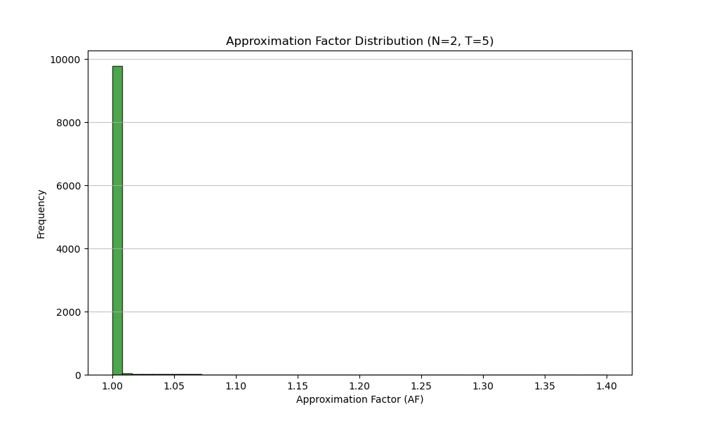

# Clustering-and-Similarity-Search-Algorithms
Υλοποίηση αλγορίθμων αναζήτησης διανυσμάτων και συσταδοποίησης σε C++ για d-διάστατους χώρους, βάσει της Euclidean (L2) metric.

Αλγόριθμοι:
1. LSH και Hypercube (random projections).
2. Αναζήτηση με k-means και Inverted File Flat (IVFFlat).
3. Αναζήτηση με k-means και Inverted File Product Quantization (IVFPQ).
4. Αναζήτηση με Neural LSH (Python/PyTorch).

Δείτε τη ροή εκτέλεσης στο `src/main.cpp`. Οι επιλογές γραμμής εντολών υλοποιούνται στον parser (`include/utils/args_parser.h`, `src/utils/args_parser.cpp`).

## Build & Run (Makefile)
### ΑΝΝ C++ Framework
Για το compiling χρησιμοποιούμε το κατάλληλο Makefile. Ενδεικτικά targets:

```
make run_lsh_mnist
make run_lsh_sift
make run_hypercube_mnist
make run_hypercube_sift
make run_ivfflat_mnist
make run_ivfflat_sift
make run_ivfpq_mnist
make run_ivfpq_sift
```

Στη συνέχεια μπορείτε να ορίσετε παραμέτρους διαδραστικά ή μέσω flags· διαφορετικά χρησιμοποιούνται οι παράμετροι της εκφώνησης. Για καθαρισμό:

```
make clean
```

Υπάρχουν και αντίστοιχα targets για εκτέλεση με Valgrind (`check_run_*algo_*data`), τα οποία απαιτούν σημαντικά περισσότερο χρόνο.

#### Common Parameters (CLI)

- `-algo`: lsh | hypercube | ivfflat | ivfpq
- `-d`: dataset file path (π.χ. SIFT: `data/sift/sift_base.fvecs`, MNIST: `data/mnist/train/train-images.idx3-ubyte`)
- `-q`: query file path (π.χ. SIFT: `data/sift/sift_query.fvecs`, MNIST: `data/mnist/query-test/t10k-images.idx3-ubyte`)
- `-o`: output file path (default: `output.txt`)
- `-type`: dataset type (`mnist` ή `sift`)
- `-threads`: number of threads (default: 1)
- `-metric`: l1 | l2 (default: l2)
- `-N`: πλήθος nearest neighbors
- `-R`: ακτίνα για range search
- `-range`: true | false

### CLI Example

```text
=== ANN Framework ===
[INPUT] Enter distance metric (l1/l2) (default: l2) (q to quit): l2
[INPUT] Enter number of threads (default: 1) (q to quit): 10
[INPUT] Enter number of nearest neighbors N (default: 1) (q to quit): 1
[INPUT] Enter search radius R (default: 0.0) (q to quit): 20
[INPUT] Enable range search? (true/false) (default: true) (q to quit): false
[INPUT] Enter seed (default: 1) (q to quit): 1
[INPUT] Enter number of clusters k (default: 50) (q to quit): 10
[INPUT] Enter clusters to probe (default: 5) (q to quit): 5

[INFO] Using configuration:
  Dataset: data/sift/sift_base.fvecs
  Queries: data/sift/sift_query.fvecs
  Output: output/ivfflat_sift_1.txt
  Type: sift
  Algorithm: ivfflat
  Metric: l2
  Threads: 10
  N=1 R=20 Range=false
  Seed=1 kclusters=10 nprobe=5
Execution Time (ms): 100274
```

### Output Format Example (C++)

```text
=== RESULTS OF IVFPQ ====
===== CONFIGURATION =====

[INFO] Using configuration:
  Dataset: data/sift/sift_base.fvecs
  Queries: data/sift/sift_query.fvecs
  Output: output/ivfpq_sift_1.txt
  Type: sift
  Algorithm: ivfpq
  Metric: l2
  Threads: 12
  N=2 R=20 Range=false
  Seed=1 kclusters=50 nprobe=5 M=16 nbits=8
Execution Time (ms): 100274
===== EVALUATION =====
Average AF: 1.07447
Recall@N: 0.45245
QPS: 99.7268
tApproximateAverage: 96.8125
tTrueAverage: 177.93
=============================================================
Query: 0
Nearest neighbor-1: 932085
distanceApproximate: 231.535172
distanceTrue: 232.871216
Nearest neighbor-2: 934876
distanceApproximate: 246.943680
distanceTrue: 234.714722
...
```

## Neural LSH (Python/PyTorch)
Η υλοποίηση του Neural LSH βρίσκεται στον φάκελο NLSH και χρησιμοποιεί Python 3.10+, PyTorch και KaHIP.

### Αρχεία
- nlsh_build.py: Κατασκευή ευρετηρίου (k-NN γράφος -> KaHIP διαμέριση -> Εκπαίδευση MLP).
- nlsh_search.py: Φόρτωση ευρετηρίου και εκτέλεση αναζήτησης.
- models.py: Αρχιτεκτονική του Νευρωνικού Δικτύου (MLP).
- graph_utils.py: Βοηθητικές συναρτήσεις για κατασκευή/διαχείριση γράφου και διαμέριση.
- data_parser.py: Parsers για τα datasets (MNIST/SIFT) και διαχείριση ορισμάτων.

### Εγκατάσταση Εξαρτήσεων
Απαιτούνται οι βιβλιοθήκες `torch`, `numpy` και `kahip`. Εγκατάσταση μέσω pip:

```bash
pip install torch numpy kahip scikit-learn
```

### Εκτέλεση (Build & Search)

Η διαδικασία χωρίζεται σε δύο φάσεις:

#### 1. Κατασκευή Ευρετηρίου (`nlsh_build.py`)
Δημιουργεί τον γράφο k-NN, εκτελεί διαμέριση και εκπαιδεύει το μοντέλο.

**Βασικές Παράμετροι:**
- `-d`, `--dataset`: (Required) Path αρχείου dataset (π.χ. sift_base.fvecs).
- `-i`, `--index`: (Required) Path prefix για την αποθήκευση του ευρετηρίου (μοντέλο και inverted index).
- `-type`, `--type`: Τύπος δεδομένων (`mnist` | `sift`). Default: `mnist`.

**Παράμετροι Κατασκευής Γράφου (k-NN):**
- `--knn`: Αριθμός γειτόνων k για τον γράφο. Default: 10.
- `--graph_method`: Μέθοδος υπολογισμού γειτόνων.
  - `sklearn`: Χρήση `NearestNeighbors` της scikit-learn (ακριβές αλλά αργό για μεγάλα datasets).
  - `cpp_subprocess`: Κλήση του C++ executable για ταχύτερη/προσεγγιστική εύρεση γειτόνων.
  - `cpp_file`: Φόρτωση έτοιμου αρχείου γειτόνων από προηγούμενη εκτέλεση.
- `--cpp_bin`: Path για το C++ executable (αν χρησιμοποιηθεί `cpp_subprocess`). Default: `../bin/search`.
- `--cpp_algo`: Αλγόριθμος C++ για εύρεση γειτόνων (`brute`, `ivfflat`, `lsh`, κλπ). Default: `brute`.

**Παράμετροι Διαμέρισης (KaHIP):**
- `-m`, `--m`: Αριθμός μερών (partitions/blocks) m. Default: 100.
- `--imbalance`: Επιτρεπτό ποσοστό ανισορροπίας στη διαμέριση. Default: 0.03.
- `--kahip_mode`: Ρύθμιση KaHIP (0=FAST, 1=ECO, 2=STRONG). Default: 2.

**Υπερπαράμετροι Εκπαίδευσης (MLP):**
- `--layers`: Αριθμός κρυφών επιπέδων (layers). Default: 3.
- `--nodes`: Αριθμός κόμβων ανά επίπεδο. Default: 64.
- `--epochs`: Περίοδοι εκπαίδευσης (epochs). Default: 10.
- `--batch_size`: Μέγεθος δέσμης (batch size). Default: 128.
- `--lr`: Ρυθμός εκμάθησης (learning rate). Default: 0.001.
- `--seed`: Seed για αναπαραγωξιμότητα. Default: 1.

**Παράδειγμα:**
```bash
python3 NLSH/nlsh_build.py -d data/sift/sift_base.fvecs -i cache/nlsh_index_sift -type sift --knn 15 -m 100 --epochs 10
```

#### 2. Αναζήτηση (`nlsh_search.py`)
Φορτώνει το ευρετήριο και εκτελεί τα queries.

**Παράμετροι:**
- `-d`, `--dataset`: (Required) Path αρχείου dataset (απαραίτητο για υπολογισμό true distances).
- `-q`, `--query`: (Required) Path αρχείου queries.
- `-i`, `--index`: (Required) Path prefix του ευρετηρίου (που δημιουργήθηκε στο build).
- `-o`, `--output`: (Required) Path αρχείου εξόδου αποτελεσμάτων.
- `-type`, `--type`: Τύπος δεδομένων (`mnist` | `sift`).
- `-N`: Πλήθος nearest neighbors που ζητούνται. Default: 1.
- `-R`: Ακτίνα αναζήτησης (Range Search). Default: 2000.0 (MNIST) / 2800.0 (SIFT).
- `-T`: Αριθμός μερών (bins) προς έλεγχο (Multi-probe). Default: 5.
- `-range`: Ενεργοποίηση range search (`true` | `false`). Default: `false`.

**Παράδειγμα:**
```bash
python3 NLSH/nlsh_search.py -d data/sift/sift_base.fvecs -q data/sift/sift_query.fvecs -i cache/nlsh_index_sift -o output/nlsh_sift_1.txt -type sift -N 10 -T 5
```

### Παραγόμενα Αρχεία & Δομή Φακέλων

Κατά την εκτέλεση του `nlsh_build.py`, παράγονται διάφορα αρχεία που αποθηκεύονται στους φακέλους cache και fig.

1.  **Μοντέλα & Ευρετήρια (cache):**
    *   `*_model.pth`: Το εκπαιδευμένο νευρωνικό δίκτυο (PyTorch state dict).
    *   `*_index_bins.npy`: Το inverted index που αντιστοιχίζει κάθε partition (bin) στα IDs των διανυσμάτων που περιέχει.
    *   `*_knn_graph.npy`: Ο γράφος k-NN (adjacency list) που υπολογίστηκε ή φορτώθηκε. Αποθηκεύεται για να αποφεύγεται ο επαναυπολογισμός σε επόμενες εκτελέσεις.

2.  **Διαγράμματα (fig):**
    *   **Partition Balance:** Ιστόγραμμα που δείχνει πόσα σημεία ανατέθηκαν σε κάθε partition (bin) από το KaHIP. Χρήσιμο για τον έλεγχο της ισορροπίας της διαμέρισης.
    *   **Learning Curve:** Γραφική παράσταση της συνάρτησης κόστους (Loss) και της ακρίβειας (Accuracy) κατά τη διάρκεια της εκπαίδευσης του MLP (Train vs Validation).
    * **Approximation Factor Distribution:** Κατανομή του παράγοντα προσέγγισης (Approximation Factor) για τα queries.
    *  Τα διαγράμματα αποθηκεύονται ως PNG αρχεία με ονόματα που περιλαμβάνουν το dataset και τις υπερπαραμέτρους εκπαίδευσης.

#### Παραδείγματα Διαγραμμάτων

**Partition Balance:**


**Learning Curve:**


**Approximation Factor Distribution:**


### Output Format Example (Neural LSH)

Το αρχείο εξόδου του `nlsh_search.py` περιέχει αναλυτικές πληροφορίες για το configuration, την εκπαίδευση και τα αποτελέσματα της αναζήτησης:

```text
===== Results of Neural LSH =====
===== CONFIGURATION =====
Dataset: data/mnist/train/train-images.idx3-ubyte
Query: data/mnist/query-test/t10k-images.idx3-ubyte
N (Neighbors): 15
T (Probed Bins): 5
Model Path: cache/nlsh_mnist_ivfflat_model.pth
Index Bins: 20 (Non-empty: 20)
Bin Sizes: Min=2543, Max=3089, Mean=3000.00, Median=3087.0

--- Build Configuration ---
m: 20
imbalance: 0.03
kahip_mode: 2
layers: 3
nodes: 512
epochs: 10
batch_size: 128
lr: 0.0001
seed: 1
final_train_acc: 0.9770
final_val_acc: 0.9568
bin_min: 2543
bin_max: 3089
bin_mean: 3000.00
bin_median: 3087.0
non_empty_bins: 20
===== EVALUATION =====
Average AF: 1.000130
Recall@N: 0.994400
QPS: 20.32
tApproximateAverage: 49.2195
tTrueAverage: 2.0921
=============================================================
Query: 0
Nearest neighbor-1: 53843
distanceApproximate: 2.653270
distanceTrue: 2.653270
Nearest neighbor-2: 38620
distanceApproximate: 3.113672
distanceTrue: 3.113672
Nearest neighbor-3: 16186
distanceApproximate: 3.383046 
...
```

## Datasets
Οι αλγόριθμοι έχουν δοκιμαστεί με τα εξής datasets:
- MNIST (60k vectors): χρησιμοποιήστε τα αρχεία στον φάκελο mnist.
- SIFT 1M: είναι μεγάλο για το repository. Κατεβάστε από ftp://ftp.irisa.fr/local/texmex/corpus/sift.tar.gz και κάντε extract στον φάκελο sift ή χρησιμοποιήστε το παρακάτω shell command:

```bash
mkdir -p data/sift && wget -P data/sift ftp://ftp.irisa.fr/local/texmex/corpus/sift.tar.gz && tar -xzvf data/sift/sift.tar.gz -C data/sift --strip-components=1 && rm data/sift/sift.tar.gz
```

Σημειώσεις:
- Τα Valgrind runs (`check_run_*`) στο Makefile είναι αργά.
- Οι τελικές ρυθμίσεις (config summary) εκτυπώνονται αυτόματα από τον parser.

## Remote Homolog Protein Search 

Εκτός από τα τυπικά vectors (MNIST/SIFT), το framework υποστηρίζει αναζήτηση ομολογίας πρωτεϊνών χρησιμοποιώντας Neural Embeddings από το μοντέλο `ESM-2`. Η διαδικασία βασίζεται στη μετατροπή αλληλουχιών FASTA σε διανύσματα ($d=320$) και στην αναζήτηση γειτόνων με μετρικές L2 (Euclidean) ή Cosine Similarity.

### Pipeline
1.  **Embed:** Το `protein_embed.py` διαβάζει FASTA αρχεία και παράγει διανύσματα (`.npy` για Python, `.fvecs` για C++).
2.  **Search:** Το `protein_search.py` λειτουργεί ως wrapper. Καλεί είτε το C++ executable (`search`) είτε το Python Neural module (`nlsh_search.py`) και συγκρίνει τα αποτελέσματα με το BLASTp (Ground Truth).

### Build & Run

Για την εκτέλεση της ροής εργασιών χρησιμοποιούμε τα παρακάτω targets.

#### Βήμα 1: Δημιουργία Embeddings
Πριν τρέξετε πειράματα, πρέπει να δημιουργήσετε τα διανύσματα από τα FASTA αρχεία.

```bash
# Για L2 Metric (Raw Embeddings)
make protein_data_l2

# Για Cosine Metric (L2-Normalized Embeddings)
make protein_data_cosine
```

#### Βήμα 2: Εκτέλεση Πειραμάτων
Τα πειράματα τρέχουν σε 4 configurations (`fast`, `balanced`, `accurate`, `extreme`) που ορίζονται στον φάκελο configs.

**L2 Experiments:**
```bash
make protein_l2_fast        # Γρήγορη αναζήτηση (Config: l2_fast_config.json)
make protein_l2_balanced    # Ισορροπημένη αναζήτηση
make protein_l2_accurate    # Έμφαση στην ακρίβεια
make protein_l2_extreme     # Πολύ υψηλή ακρίβεια (αργό)

# Εκτέλεση όλων των L2 πειραμάτων σειριακά
make run_protein_l2_all
```

**Cosine Experiments:**
```bash
make protein_cosine_fast
make protein_cosine_balanced
make protein_cosine_accurate
make protein_cosine_extreme

# Εκτέλεση όλων των Cosine πειραμάτων σειριακά
make run_protein_cosine_all
```

### CLI Parameters

Αν θέλετε να τρέξετε το script αναζήτησης χειροκίνητα (εκτός Makefile):

```bash
python3 Protein_Search/protein_search.py [OPTIONS]
```

- `-d`: Path prefix για τη βάση δεδομένων (χωρίς extension, π.χ. `data/protein/protein_db`).
- `-q`: Path prefix για τα queries (χωρίς extension).
- `-db_fasta`: Path στο αρχείο FASTA της βάσης (για BLAST Ground Truth).
- `-q_fasta`: Path στο αρχείο FASTA των queries.
- `-o`: Path για το αρχείο εξόδου (Report).
- `-N`: Αριθμός γειτόνων (Default: 50).
- `-method`: Αλγόριθμοι προς εκτέλεση (π.χ. `lsh,ivfflat` ή `all`).
- `-config`: Path σε JSON αρχείο ρυθμίσεων (αντικαθιστά τα defaults).

**Παράδειγμα:**
```bash
python3 Protein_Search/protein_search.py \
  -d data/protein/protein_db \
  -q data/protein/targets_vectors \
  -db_fasta data/protein/swissprot_50k.fasta \
  -q_fasta data/protein/targets.fasta \
  -config configs/l2_balanced_config.json \
  -o output/protein/manual_run.txt
```

#### Cleanup
Για να διαγράψετε τα παραγόμενα αρχεία δεδομένων πρωτεϊνών:

```bash
make clean_protein_data
```
#### Editing Configuration Files
Τα αρχεία ρυθμίσεων (`configs/*.json`) περιέχουν παραμέτρους για κάθε αλγόριθμο. Μπορείτε να τα επεξεργαστείτε για να προσαρμόσετε τις παραμέτρους των πειραμάτων.
** Παραδειγμα αρχείου ρυθμίσεων (l2_balanced_config.json):**
```json
{
  "metric": "l2",
  "global_seed": 1,
  "range_search": false,
  "lsh": {
    "k": 5,
    "L": 8,
    "w": 5.0
  },
  "hypercube": {
    "kproj": 14,
    "w": 5.0,
    "M": 5000,
    "probes": 10
  },
  "ivfflat": {
    "kclusters": 200,
    "nprobe": 20
  },
  "ivfpq": {
    "kclusters": 200,
    "nprobe": 20,
    "M": 32,
    "nbits": 8
  },
  "neural": {
    "m": 400,
    "T": 50,
    "k": 20,
    "epochs": 20,
    "layers": 4,
    "nodes": 256,
    "lm": 1.0
  }
}
```
*Σημείωση: Διαβάστε παραπάνω για να δείτε τη λειτουργία των παραμέτρων που χρησιμοποιούμε στο αρχείο ρυθμίσεων.*

### Output Format Example

Το αρχείο αποτελεσμάτων παρέχει στατιστικά σύγκρισης με το BLAST και βιολογικό σχολιασμό των γειτόνων.

```text
Protein Homology Search Report
==============================

[0] Configuration Parameters
-------------------------------------------------------------------------------------
Metric: l2
Global Seed: 1
Range Search: False (R=0.0)

Algorithm Parameters:
  - LSH       : k=5, L=8, w=5.0
  - HYPERCUBE : kproj=14, w=5.0, M=5000, probes=10
  - IVFFLAT   : kclusters=200, nprobe=20
  - IVFPQ     : kclusters=200, nprobe=20, M=32, nbits=8
  - NEURAL    : m=400, T=50, k=20, epochs=20, layers=4, nodes=256, lm=1.0
-------------------------------------------------------------------------------------

[1] Summary Comparison (Ground Truth: BLAST, N=50)
----------------------------------------------------------------------------------------------------
Method          | Time/query (s)  | QPS        | Recall@N   | Avg AF    
----------------------------------------------------------------------------------------------------
LSH             | 0.6679          | 160.3      | 0.0267     | 1.5064    
HYPERCUBE       | 0.0590          | 166.6      | 0.2200     | 1.0768    
IVFFLAT         | 0.5091          | 227.6      | 0.2660     | 1.0000    
IVFPQ           | 6.2638          | 164.5      | 0.2210     | 1.4131    
NEURAL          | 151.3890        | 56.2       | 0.3113     | 1.0000    
BLAST (Ref)     | -               | -          | 1.0000     | 1.0000    
----------------------------------------------------------------------------------------------------

[2] Detailed Top-N Analysis (All Queries)

QUERY PROTEIN: A0A009I3Y5

Method: LSH
-------------------------------------------------------------------------------------------------------------------
Rank  | Neighbor ID               | L2 Dist    | BLAST %  | In BLAST Top-N?    | Bio Comment
-------------------------------------------------------------------------------------------------------------------
1     | sp|Q1Q8I2|TPMT_PSYCK      | 2.0270     | 0.0      | No                 | Likely False Positive
2     | sp|A1RP91|TRMA_SHESW      | 2.1295     | 0.0      | No                 | Likely False Positive
3     | sp|P44509|Y093_HAEIN      | 2.1908     | 0.0      | No                 | Likely False Positive
4     | sp|P45544|FRLR_ECOLI      | 2.2433     | 0.0      | No                 | Likely False Positive
5     | sp|Q4A180|DNAA_STAS1      | 2.3021     | 0.0      | No                 | Likely False Positive
6     | sp|B4TNU5|WECF_SALSV      | 2.3056     | 0.0      | No                 | Likely False Positive
7     | sp|Q9V3Z1|TRIB_DROME      | 2.3101     | 0.0      | No                 | Likely False Positive
8     | sp|Q9SIZ4|Y2027_ARATH     | 2.3133     | 0.0      | No                 | Likely False Positive
9     | sp|Q9ZDW2|UVRB_RICPR      | 2.3168     | 0.0      | No                 | Likely False Positive
10    | sp|Q9FE20|PBS1_ARATH      | 2.3175     | 0.0      | No                 | Likely False Positive
11    | sp|P45756|GSPA_ECOLI      | 2.3206     | 0.0      | No                 | Likely False Positive
12    | sp|Q54R98|Y3301_DICDI     | 2.3297     | 0.0      | No                 | Likely False Positive
13    | sp|Q5X5X1|HIS7_LEGPA      | 2.3298     | 0.0      | No                 | Likely False Positive
14    | sp|P77439|PTFX1_ECOLI     | 2.3518     | 0.0      | No                 | Likely False Positive
15    | sp|P44145|Y1266_HAEIN     | 2.3623     | 0.0      | No                 | Likely False Positive
...
```